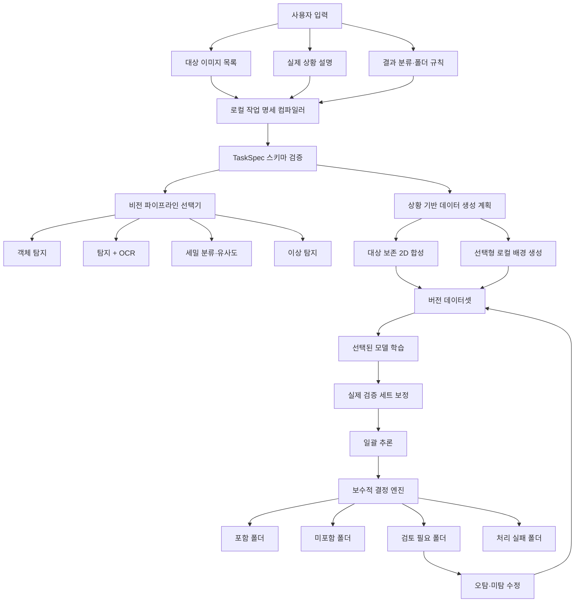

# VisionForge 범용 동적 학습·분류 기능 구현 검토

> 후속 상태: 이 문서는 구현 착수 전 격차 검토 기록이다. 이후 TaskSpec 리비전, 상황 기반 생성 정책, 이중 임계값, 사용자 정의 결과 폴더 라우팅, TaskSpec 포함 모델 패키지가 범용 동적 v1으로 구현되었다. 최신 상태는 `IMPLEMENTATION_STATUS.md`와 `VISIONFORGE_REQUIREMENTS_SPEC.md`를 기준으로 한다.

> 검토일: 2026-07-12  
> 검토 대상: 현재 `VisionForge` 저장소의 UI, Rust 코어, Python 이미지 엔진, 테스트  
> 사용자 의도: 대상 이미지 목록, 실제 사용 상황 설명, 결과 분류 방식을 입력하면 프로그램이 작업별 학습 계획을 만들고 학습한 뒤 지정한 방식으로 이미지를 분류하는 범용 오프라인 프로그램

## 1. 최종 판정

**현재 구현은 사용자가 설명한 범용 동적 학습·분류 시스템으로 동작하지 않는다.**

현재 구현된 것은 다음 범위의 기능형 기준선이다.

- 프로젝트당 대상 클래스 1개
- 대상 이미지와 사용자가 준비한 배경 이미지 등록
- 대상 전경을 배경 위에 한 개씩 붙이는 고정 2D 합성
- 합성 Box 검토 및 단일 클래스 데이터셋 생성
- 색상·명암·윤곽 통계를 이용하는 고정 경량 탐지기 학습
- 실제 이미지에서 Box와 탐지 개수 표시
- 모든 결과 미리보기를 하나의 작업 결과 폴더에 저장

반면 요청한 제품은 아래 기능을 함께 가져야 한다.

- 자연어 또는 구조화 입력을 실행 가능한 작업 명세로 변환
- 상황에 맞는 데이터 생성 계획 수립
- 작업 성격에 맞는 비전 파이프라인 선택
- 학습·검증·신뢰도 보정
- 포함·미포함·불확실·실패 등의 결과 규칙 판정
- 지정한 폴더 구조로 원본 또는 결과 이미지 분류
- 실제 결과의 오탐·미탐을 반영하는 반복 학습

따라서 현재 상태는 **기반 파이프라인 일부 구현**이며, **범용 동적 기능 완료**로 판단하면 안 된다.

## 2. 요구 기능별 구현 상태

| 요구 기능 | 현재 상태 | 판정 |
|---|---|---|
| 대상 이미지 여러 장 입력 | 단일 클래스에 여러 장 등록 가능 | 부분 충족 |
| 상황 설명 입력 | UI, API, DB에 상황 설명 필드 없음 | 미구현 |
| 결과 분류 방법 설명 | 결과 규칙이나 폴더 정책 스키마 없음 | 미구현 |
| 설명을 학습 계획으로 변환 | 규칙 파서, 로컬 LLM, 작업 명세 컴파일러 없음 | 미구현 |
| 상황에 맞는 이미지 생성 | 사용자가 제공한 배경에 대상 1개를 고정 규칙으로 합성 | 부분 구현 |
| 배경 없이 새로운 상황 이미지 생성 | 로컬 이미지 생성 모델과 배경 자산 공급 체계 없음 | 미구현 |
| 대상 포함·미포함 학습 | 합성 양성과 승인된 배경 음성만 사용 | 제한적 구현 |
| 범용 사물 탐지 학습 | 32x32 수작업 특징 기반 실험용 선형 탐지기 | 요구 수준 미달 |
| 작업별 모델·파이프라인 선택 | 항상 동일 탐지기와 동일 생성기 사용 | 미구현 |
| 포함·미포함 폴더 분류 | UI에서 탐지 개수만 표시하며 폴더 라우팅 없음 | 미구현 |
| 불확실 결과 격리 | 단일 신뢰도 임계값만 존재 | 미구현 |
| 오탐·미탐 재학습 | 추론 결과를 데이터셋으로 전환하는 경로 없음 | 미구현 |
| 완전 오프라인 실행 | 현재 기준선 기능은 오프라인 실행 | 충족 |
| 모델 내보내기·가져오기 | `.vfmodel` 패키지 지원 | 충족 |

## 3. 주요 발견 사항

### P0. 작업 설명을 저장하거나 해석하는 구조가 없다

UI가 받는 작업 정의 값은 사실상 클래스 이름, 생성 수, 랜덤 시드, 추론 임계값뿐이다.

- `apps/desktop/src/App.tsx:95-98`
- `apps/desktop/src/App.tsx:248-251`
- `apps/desktop/src/bridge.ts:126-146`
- `crates/visionforge-core/src/project.rs:30-35`

`상황 설명`, `대상 특성`, `실제 입력 조건`, `분류 규칙`, `출력 폴더`, `오류 허용 수준`을 표현하는 도메인 모델이 없다. 따라서 현재 프로그램은 사용자의 설명을 이해하지도, 그 설명에 맞춰 생성·학습·분류 방식을 바꾸지도 못한다.

### P0. 하나의 고정 모델로 모든 유형의 작업을 처리한다

현재 엔진은 이름부터 `visionforge-linear-feature-detector-v1`로 고정되어 있다. 후보 영역을 32x32로 축소한 뒤 색상 히스토그램, 명암 방향, 평균·표준편차를 계산하고 양성·음성 평균 차이로 가중치를 만든다.

- `engine/src/visionforge_engine/detector.py:28-29`
- `engine/src/visionforge_engine/detector.py:58`
- `engine/src/visionforge_engine/detector.py:190-218`
- `engine/src/visionforge_engine/detector.py:322`
- `engine/src/visionforge_engine/detector.py:407`

이 모델은 색과 단순 형태가 뚜렷한 통제된 예제에서는 동작할 수 있지만 다음을 범용적으로 처리할 수 없다.

- 다양한 시점·가림·크기 변화가 있는 일반 사물
- 서로 매우 비슷한 여러 제품이나 개체의 구분
- 배번호처럼 작은 문자와 정확한 문자열 판독
- 결함·이상 탐지
- 대상의 의미만 같고 외형이 다양한 범주

범용 제품에는 작업 유형별 백엔드가 필요하다. 예를 들어 일반 사물 존재 여부는 객체 탐지, 정확한 문자열은 탐지와 OCR, 유사 개체 구분은 세밀 분류 또는 유사도 학습, 결함은 이상 탐지 파이프라인이 적합하다. 자연어 해석기가 있더라도 이 비전 모델들을 대신할 수는 없다.

### P0. 요청한 결과 폴더 분류기가 없다

추론 결과는 모두 `assets/results/<job-id>` 아래의 Box 표시 PNG로 저장된다.

- `apps/desktop/src-tauri/src/lib.rs:256`
- `crates/visionforge-core/src/model.rs:527-630`
- `crates/visionforge-core/src/model.rs:652-704`

UI는 탐지가 없으면 `대상 없음`, 있으면 탐지 개수를 표시할 뿐이다.

- `apps/desktop/src/App.tsx:885-895`

`사물 포함`, `사물 미포함`, `불확실`, `처리 실패` 폴더를 만들거나 입력 원본을 해당 폴더로 복사·연결하는 결과 라우터가 없다. 사용자 정의 폴더명, 중복 파일명 처리, 원본 보존 방식, 재실행 시 충돌 정책도 없다.

### P1. 이미지 생성이 상황 설명에 따라 변하지 않는다

현재 생성기는 대상 하나와 배경 하나를 임의 선택하고, 고정 범위 안에서 크기·회전·위치·밝기·블러를 바꾼다.

- `engine/src/visionforge_engine/compositor.py:16-41`
- `engine/src/visionforge_engine/compositor.py:215-242`

UI에서 조절 가능한 생성 값은 생성 수와 시드뿐이다.

- `apps/desktop/src/App.tsx:585-598`

다음 조건은 현재 생성 계획에 반영되지 않는다.

- 실내·실외, 장소, 날씨, 시간대
- 원근과 카메라 시점
- 부분 가림과 주변 물체
- 이미지당 대상 개수
- 상황별 비율과 음성 이미지 비율
- 카메라 노이즈와 압축 손상
- 설명에 맞는 배경 자동 생성 또는 선택

즉, 프로그램이 상황에 맞는 장면을 새로 만드는 것이 아니라 사용자가 준 배경 위에 전경을 붙인다. 적절한 배경을 사용자가 제공하지 않으면 설명한 상황을 재현할 수 없다.

### P1. 단일 임계값은 안전한 자동 분류 기준이 아니다

현재 `confidence`는 검증 세트로 확률 보정된 값이 아니라 선형 점수를 로지스틱 함수로 변환한 값이다. 학습 양성 20분위와 음성 90분위 사이에서 내부 기준을 만들고 기본 임계값 `0.55`를 사용한다.

- `engine/src/visionforge_engine/detector.py:172`
- `engine/src/visionforge_engine/detector.py:390-422`

따라서 UI의 백분율을 실제 오류 확률로 해석하면 안 된다. 또한 현재는 하나의 임계값만 사용하므로 경계값을 별도 `검토 필요` 폴더로 보내는 안전 구간이 없다.

자동 전달이나 식별처럼 오분류 비용이 큰 작업은 최소한 다음 결정 구조가 필요하다.

- 높은 양성 기준 이상: 포함 폴더
- 낮은 음성 기준 이하: 미포함 폴더
- 두 기준 사이: 검토 필요 폴더
- 입력 손상·엔진 실패: 처리 실패 폴더
- 분포 밖 이미지 또는 서로 충돌하는 결과: 검토 필요 폴더

두 기준은 고정 숫자가 아니라 사용자가 제공한 실제 검증 세트에서 목표 정밀도에 맞춰 보정해야 한다.

### P1. 실제 사진 피드백이 학습 데이터로 돌아가지 않는다

데이터셋 후보는 승인된 `generated_positive`와 `background` 역할만 조회한다.

- `crates/visionforge-core/src/dataset.rs:209-220`
- `crates/visionforge-core/src/dataset.rs:284`

추론한 실제 사진을 오탐·미탐·저신뢰로 표시하고 Box를 수정한 뒤 다음 데이터셋 버전에 포함하는 기능이 없다. 합성 이미지와 실제 사진의 차이를 자동으로 줄일 핵심 반복 학습 경로가 아직 끊겨 있다.

### P1. 테스트 통과가 범용 성능을 의미하지 않는다

현재 테스트는 단색 배경 위의 빨간 사각형을 학습하고 다시 빨간 사각형을 찾는 수준이다.

- `engine/tests/test_detector.py:14-22`
- `engine/tests/test_detector.py:107`
- `engine/tests/test_compositor.py:19-55`

검토 시점 테스트 결과는 Python 8개, Rust 7개, 프론트엔드 2개와 TypeScript 검사가 모두 통과했다. 이는 코드 계약과 현재 기준선 흐름이 작동한다는 뜻이지, 실제 사물·자연어 작업·결과 폴더·불확실성 격리의 요구사항을 검증한 것은 아니다.

## 4. 기존 기획과 현재 요청의 차이

현재 구현은 기존 기획에서 좁게 잡은 MVP 결정을 따른 흔적이 분명하다.

- 구조화 옵션 우선, 로컬 LLM 제외: `VISIONFORGE_PRODUCT_PLAN.md:58`
- 프로젝트당 단일 대상 클래스: `VISIONFORGE_PRODUCT_PLAN.md:116`
- 다중 클래스 동시 학습 제외: `VISIONFORGE_PRODUCT_PLAN.md:136`
- 로컬 생성형 이미지 모델 제외: `VISIONFORGE_PRODUCT_PLAN.md:140`
- 자연어 처리는 후속 검토: `VISIONFORGE_PRODUCT_PLAN.md:795`
- 로컬 생성형 모델은 MVP 제외: `VISIONFORGE_PRODUCT_PLAN.md:797-801`

다만 원본 확정 요구사항 PDF에는 `상황 및 생성 조건 설정`과 다양한 결과 상태가 MVP 항목으로 포함되어 있다. 현재 UI는 구조화 상황 옵션조차 구현하지 않았으므로 기존 좁은 MVP 기준으로 보더라도 이 부분은 미완성이다.

이번 사용자 설명은 제품의 핵심을 `고정 단일 탐지 프로젝트`에서 `사용자 작업 설명으로 파이프라인을 구성하는 범용 비전 작업 제작기`로 확장한다. 이는 화면 몇 개를 추가하는 변경이 아니라 도메인 모델과 학습 엔진 구조를 다시 잡아야 하는 요구사항이다.

## 5. 필요한 목표 구조



### 5.1 작업 명세 예시

자연어를 모델에 바로 전달하지 말고, 아래와 같은 검증 가능한 `TaskSpec`으로 변환해야 한다.

```json
{
  "taskType": "object_presence",
  "targets": [
    {
      "id": "target-1",
      "name": "특정 사물",
      "referenceImages": ["..."]
    }
  ],
  "scenario": {
    "description": "실내외 사진이며 대상이 작거나 일부 가려질 수 있음",
    "structured": {
      "distance": ["near", "far"],
      "occlusion": [0.0, 0.4],
      "lighting": ["bright", "dark", "backlit"]
    }
  },
  "outputs": [
    {"id": "present", "folder": "사물_포함"},
    {"id": "absent", "folder": "사물_미포함"},
    {"id": "review", "folder": "검토_필요"},
    {"id": "failed", "folder": "처리_실패"}
  ],
  "safety": {
    "routingMode": "conservative",
    "requireRealValidation": true
  }
}
```

로컬 LLM을 추가한다면 역할은 자연어를 이 명세로 변환하는 데 한정하는 편이 안전하다. 출력은 JSON 스키마 검증을 통과해야 하며, 지원하지 않는 요구는 임의 해석하지 말고 사용자에게 명시적으로 표시해야 한다.

### 5.2 범용성의 현실적인 범위

모든 이미지 작업을 하나의 탐지 모델로 해결할 수는 없다. 프로그램은 아래처럼 작업 유형을 구분해야 한다.

| 사용자 작업 | 적합한 파이프라인 |
|---|---|
| 특정 사물 포함·미포함 | 객체 탐지 또는 이미지 분류 |
| 여러 사물의 위치·개수 | 객체 탐지 |
| 배번호·제품 코드처럼 정확한 문자열 | 영역 탐지 + OCR + 허용 목록 대조 |
| 매우 비슷한 개체 구분 | 세밀 분류 또는 유사도 학습 |
| 정상과 결함 구분 | 이상 탐지 또는 결함 분류 |

즉, 범용성은 `모델 하나가 모든 것을 처리`하는 방식이 아니라 `설명을 분석해 검증된 파이프라인 중 맞는 것을 선택`하는 방식으로 구현해야 한다.

### 5.3 이미지 생성 방식

대상 자체를 생성형 모델로 다시 그리면 로고, 문자, 형태가 바뀔 수 있다. 기본 생성 전략은 다음 순서가 적합하다.

1. 사용자 대상 원본을 보존한다.
2. 전경만 분리한다.
3. 실제 배경 또는 로컬 배경 자산을 상황에 맞게 선택한다.
4. 크기, 시점, 원근, 가림, 조명, 노이즈를 TaskSpec 분포에 따라 적용한다.
5. 필요하면 로컬 생성 모델은 대상이 아닌 배경 생성에 우선 사용한다.
6. 최종 대상 마스크에서 라벨을 자동 계산한다.
7. 실제 사진 검증 결과가 기준을 통과하지 못하면 자동 분류를 허용하지 않는다.

디스크 사용량은 `검토용 미리보기 세트`와 `학습 시점에 생성하는 일시 데이터`를 분리해 관리해야 한다. 모든 변형 이미지를 영구 저장하지 않고 레시피·시드·체크섬을 보존하며, 사용자가 정한 캐시 한도 안에서만 재사용하는 방식이 적합하다.

## 6. 권장 개발 순서

### 1단계: 작업 명세와 결과 라우팅

- `TaskSpec`, `ScenarioSpec`, `OutputPolicy`, `SafetyPolicy` 스키마 추가
- 자연어 없이도 모든 조건을 입력할 수 있는 구조화 UI 추가
- 포함·미포함·검토 필요·실패 폴더 라우터 구현
- 원본 보존, 동일 파일명 충돌, 재실행, 중복 복사 정책 구현

### 2단계: 실제 탐지 모델과 보정 체계

- 사전 학습 기반 객체 탐지 백엔드 도입
- 모델 백엔드 플러그인 인터페이스 추가
- 실제 사진 검증 세트 필수화
- 양성·음성 이중 임계값과 불확실 구간 도입
- 정밀도 우선, 재현율 우선 등 작업별 비용 정책 추가

### 3단계: 상황 기반 생성 계획

- 구조화 상황 조건을 합성 레시피 분포로 변환
- 원근, 가림, 다중 대상, 노이즈, 압축, 음성 비율 추가
- 배경 자산 검색·분류 체계 추가
- 메모리 스트리밍과 디스크 캐시 한도 추가

### 4단계: 반복 학습

- 추론 결과 검토 상태 추가
- 오탐·미탐·저신뢰를 새 데이터셋 버전에 포함
- 이전 모델과 새 모델을 같은 실제 평가 세트에서 비교
- 기준 미달 모델의 자동 배포 차단

### 5단계: 자연어와 선택형 생성 기능

- 규칙·키워드 파서 우선 구현
- 자유로운 자연어가 꼭 필요할 때 선택형 로컬 LLM 추가
- 배경 자산으로 표현할 수 없는 상황에 한해 선택형 로컬 이미지 생성 패키지 검토
- 생성 결과가 대상 정체성을 훼손하지 않는지 별도 검사

## 7. 완료 판정에 필요한 수용 테스트

다음 테스트가 없으면 범용 동적 기능이 구현됐다고 판단하면 안 된다.

1. 서로 다른 사물 3종이 동일한 프로그램 흐름에서 별도 프로젝트로 학습된다.
2. 각 프로젝트의 상황 조건이 실제 생성 레시피와 데이터 분포를 다르게 만든다.
3. 포함·미포함·검토 필요·실패 폴더가 사용자 지정 이름으로 생성된다.
4. 동일 파일명과 재실행 상황에서도 원본이 덮어써지거나 유실되지 않는다.
5. 대상이 작거나 일부 가려진 이미지는 잘못된 확정 폴더가 아니라 검토 필요로 격리된다.
6. 대상과 유사하지만 다른 사물이 포함된 강한 음성 세트에서 목표 정밀도를 통과한다.
7. 합성 평가가 아니라 별도로 보관한 실제 사진 평가에서 기준을 통과한다.
8. 오탐·미탐 수정 후 새 데이터셋과 모델 버전이 생성되고 이전 모델보다 개선된다.
9. 네트워크 차단 상태에서 입력부터 결과 폴더 생성까지 완료된다.
10. 캐시 한도와 디스크 부족 상황에서 원본 보존과 안전한 중단이 보장된다.

## 8. 결론

현재 코드에는 이미지 등록, 합성, 데이터셋 버전, 로컬 학습·추론, 모델 패키징처럼 재사용할 수 있는 기반이 있다. 그러나 사용자가 원하는 핵심인 `설명 기반 작업 구성`, `상황 기반 생성`, `작업별 모델 선택`, `보수적 결과 판정`, `사용자 정의 폴더 분류`는 구현되어 있지 않다.

특히 현재 실험용 선형 탐지기의 정확도와 단일 임계값을 그대로 사용해 자동 폴더 분류를 추가하는 것은 위험하다. 먼저 작업 명세와 결과 라우터를 만들고, 실제 사진 검증을 통과하는 모델 백엔드와 불확실성 격리 구조를 도입해야 한다.
