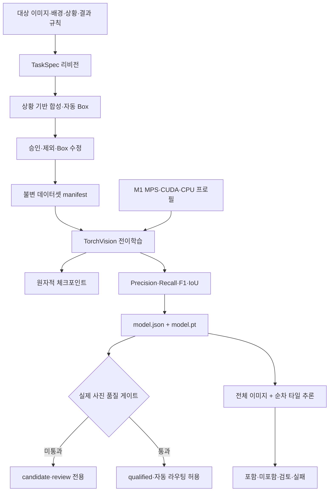
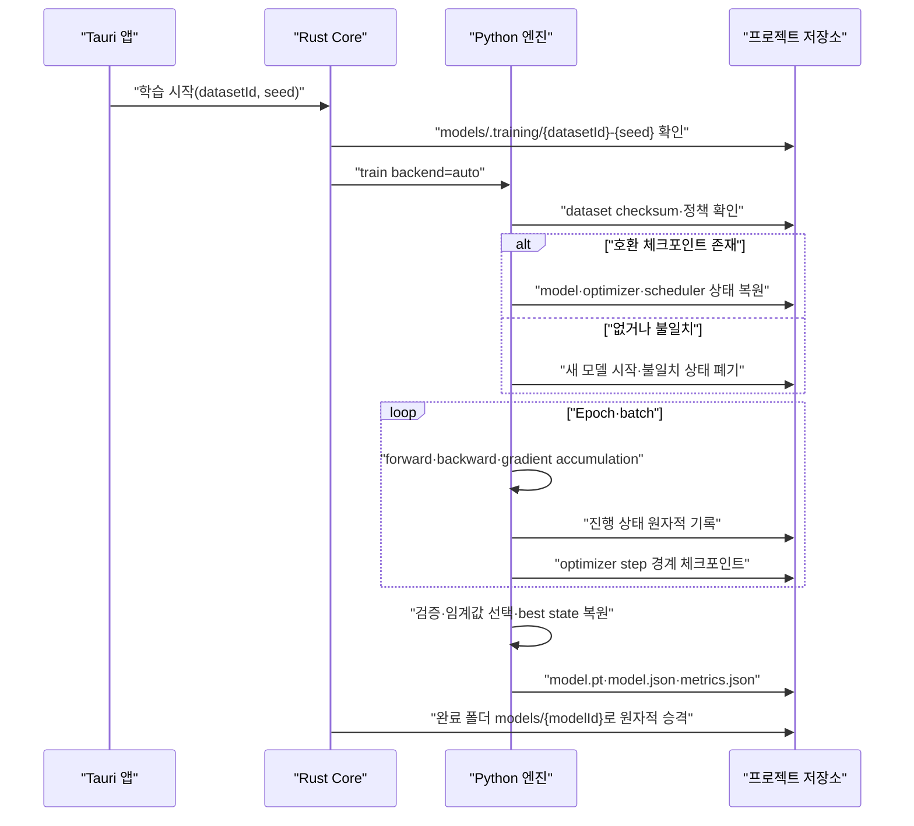

# VisionForge 고성능 비전 백엔드 구현서

> 기준일: 2026-07-13
> 대상 장비: MacBook Pro 16-inch, M1 Pro, 통합 메모리 16GB
> 허용 학습 시간: 작업당 최대 72시간
> 현재 지원 작업: `object_presence`

## 1. 구현 목표와 경계

이번 구현의 목표는 기존 파이프라인 검증용 선형 특징 모델을 실제 전이학습 가능한 객체 탐지 모델로 교체하는 것이다. 입력 이미지를 로컬에서 학습하고, 여러 객체와 고해상도 사진을 탐지하며, 실제 사진 검증 전에는 자동 분류하지 않는 안전 기본값을 제공한다.

이 백엔드는 LLM이 아니다. 학습에는 TorchVision의 Faster R-CNN 계열 CNN 탐지 모델을 사용한다. 상황 설명은 현재 규칙 기반 TaskSpec 컴파일러가 생성 정책으로 변환하며, 자연어 생성 모델이 객체 탐지 학습에 관여하지 않는다.

현재 범위는 한 작업에서 하나의 대상 클래스가 사진에 존재하는지, 어디에 있는지 탐지하는 기능이다. 배번호 문자열 판독, 서로 비슷한 개체의 신원 구분, 이상 탐지는 별도 OCR·세밀 분류·이상 탐지 백엔드가 필요하다.

## 2. 전체 구조



### 책임 분리

| 계층 | 책임 |
|---|---|
| React UI | 프로젝트 흐름, 설정, 진행 상태, 경고 표시 |
| Tauri Rust | 파일 경계, 작업 상태, sidecar 호출, 결과 기록 |
| `visionforge-core` | SQLite, TaskSpec, 데이터셋·모델 계보, 품질 라우팅 |
| Python sidecar | 이미지 처리, 학습, 평가, 추론, 모델 패키지 |
| 프로젝트 저장소 | 원본, 합성본, manifest, 체크포인트, 모델, 결과 |

## 3. 핵심 구현 파일

| 파일 | 구현 내용 |
|---|---|
| `engine/src/visionforge_engine/hardware.py` | OS·아키텍처·RAM·MPS·CUDA·CPU·디스크 프로필 |
| `engine/src/visionforge_engine/torch_detector.py` | 모델 생성, 학습, 평가, 체크포인트, 타일 추론 |
| `engine/src/visionforge_engine/detector.py` | Torch 기본 백엔드와 명시적 선형 기준선 dispatch |
| `engine/src/visionforge_engine/package.py` | 가중치·라이선스 포함 `.vfmodel` 무결성 검증 |
| `apps/desktop/src-tauri/src/engine.rs` | JSON sidecar 계약과 배포 엔진 경로 |
| `apps/desktop/src-tauri/src/lib.rs` | 재개 작업 폴더와 완료 모델의 불변 승격 |
| `crates/visionforge-core/src/model.rs` | 모델 배포 상태 저장 |
| `crates/visionforge-core/src/routing.rs` | 미승격 모델의 자동 라우팅 차단 |
| `scripts/build-engine-sidecar.mjs` | Windows·macOS 공용 PyInstaller `onedir` 빌드 |
| `scripts/prepare-desktop-bundle.mjs` | sidecar 신선도 검사와 프런트엔드 빌드 |

## 4. 모델과 학습 정책

### 4.1 모델

- 엔진 ID: `visionforge-torchvision-fasterrcnn-mobilenet-v3-v1`
- 아키텍처: `fasterrcnn_mobilenet_v3_large_fpn`
- 출력 클래스: 배경 1개 + 사용자 대상 1개
- 사전학습 가중치: TorchVision Faster R-CNN MobileNetV3-Large FPN
- 가중치 SHA-256: `fb6a3cc702b1df54c18a44b26708cd083614211062d0c36d2ca7bf9270df3533`
- 학습 산출물: `model.json`, `model.pt`, `metrics.json`, `progress.json`

번들 가중치는 체크섬이 일치할 때만 로드한다. COCO 예측기의 배경 파라미터는 보존하고 객체 클래스 파라미터 평균을 사용자 대상 초기값으로 사용한다. backbone 전체를 처음부터 다시 학습하지 않고 마지막 계층 일부와 FPN·탐지 head를 미세조정한다.

### 4.2 기본 정책

| 항목 | 기본값 |
|---|---|
| Epoch | 20 |
| 조기 종료 patience | 5 |
| Optimizer | AdamW |
| Learning rate | 0.0002 |
| Weight decay | 0.0001 |
| 짧은 변 | 640px |
| 긴 변 최대 | 960px |
| 학습 backbone 단계 | 2 |
| 체크포인트 간격 | 최대 30분 또는 epoch 종료 |
| 목표 Precision | 0.98 |
| NMS IoU | 0.45 |

### 4.3 M1 Pro 16GB 정책

| 항목 | 값 |
|---|---|
| 실행 공급자 | MPS 우선, CPU fallback 허용 |
| Batch | 1 |
| Gradient accumulation | 8 |
| DataLoader worker | 0 |
| 정밀도 | FP32 |
| 이미지 로딩 | 한 장 또는 제한 배치 스트리밍 |
| 고해상도 처리 | 전체 축소본과 타일을 순차 처리 |

CUDA 장비는 자동 혼합 정밀도를 사용한다. MPS는 결과 안정성 검증 전까지 혼합 정밀도를 사용하지 않는다. Windows 잠금 기반 배포는 CPU 휠을 사용하며, CUDA는 개발 또는 선택형 가속 환경으로 분리한다.

## 5. 학습 실행과 재개



재개 조건은 엔진 ID, 데이터셋 manifest SHA-256, 전체 학습 정책이 모두 같아야 한다. 조건이 다르면 체크포인트와 best state를 사용하지 않는다. 누적 경사의 중간 상태가 손실되지 않도록 optimizer step이 끝난 경계에서만 시간 기반 체크포인트를 저장한다.

성공하면 임시 체크포인트를 제거하고 최종 모델만 남긴다. 실패하면 `progress.json`에 단계와 오류를 기록하고 정상 체크포인트는 다음 동일 작업에서 재사용한다.

## 6. 평가와 품질 게이트

검증 이미지마다 score가 있는 Box를 모으고 IoU 0.5에서 TP·FP·FN을 계산한다. 후보 임계값별 Precision·Recall·F1·평균 IoU를 비교한다. Precision 0.98 이상인 후보가 있으면 그 안에서 Recall을 최대화하고, 없으면 F1과 Precision이 높은 보수적 임계값을 선택한다.

이 평가는 학습 파이프라인의 내부 검증일 뿐 실제 배포 승격 근거가 아니다.

| 상태 | 의미 | 자동 결과 폴더 |
|---|---|---|
| `experimental` | 독립 검증 분할도 없음 | 금지 |
| `candidate` | 내부 검증 완료, 실제 사진 고정 평가 미완료 | 금지 |
| `qualified` | 실제 사진 품질 기준 통과 | 허용 |

현재 학습 모델은 최대 `candidate`까지만 생성한다. Rust 라우터가 `qualified`가 아닌 모델의 성공 결과를 무조건 검토 폴더로 보낸다. 실제 평가 세트 등록과 `qualified` 승격 UI가 구현될 때까지 오분류 자동 전달을 허용하지 않는다.

## 7. 추론

1. `model.json`의 엔진 형식과 `model.pt` SHA-256을 검사한다.
2. 실행 장치를 MPS, CUDA, CPU 순으로 선택한다.
3. EXIF 방향을 적용하고 RGB로 변환한다.
4. 최대 변이 1600px 이하이면 전체 이미지만 처리한다.
5. 더 크면 전체 축소본과 1280px·20% 겹침 타일을 순차 처리한다.
6. 타일 Box를 원본 좌표로 복원하고 전역 NMS를 수행한다.
7. 원본 크기의 결과 미리보기와 항목별 처리 시간·체크섬을 저장한다.
8. 한 이미지가 실패해도 나머지 입력은 계속 처리한다.

타일을 모두 메모리에 올리지 않기 때문에 16GB 통합 메모리에서 고해상도 입력의 순간 메모리 사용을 제한한다. 현재 구현은 처리량보다 메모리 안정성을 우선한다.

## 8. 이미지와 저장공간

상황 기반 합성본은 사용자가 검토하고 Box를 수정할 수 있어 실제 PNG로 프로젝트에 저장한다. 반면 학습 시점의 추가 텐서 변형은 메모리에서만 처리하므로 같은 이미지를 밝기·반전별 파일로 반복 저장하지 않는다.

현재 영구 저장 대상은 다음과 같다.

- 등록 원본과 배경
- 검토 대상 합성 PNG와 생성 레시피
- 승인 상태와 불변 데이터셋 manifest
- 약 76MB의 학습 모델 가중치와 작은 메타데이터
- 사용자가 요청한 추론 미리보기와 분류 복사본

생성 캐시 상한, 시작 전 예상 총용량, 오래된 생성본 정리 UI는 아직 구현되지 않았다. 따라서 대량 작업 전에는 `max(100GB, 예상 원본 + 합성본 + 결과 복사본 + 20%)`의 여유 공간을 수동 확보해야 한다.

## 9. 모델 패키지와 라이선스

`.vfmodel`은 다음을 포함한다.

- `model/model.json`과 `model/model.pt`
- 전처리·후처리 정책
- 클래스와 TaskSpec
- 학습 지표와 배포 상태
- PyTorch·TorchVision 라이선스와 notice
- 사전학습 가중치 출처·SHA-256·COCO 고지
- 모든 구성 파일의 SHA-256 inventory

가져오기는 경로 탈출, 심볼릭 링크, 중복 경로, 압축 폭탄, 크기 한도, 체크섬, 엔진·클래스·가중치 일치를 검사한다. 기술적 고지는 구현됐지만 사전학습 체크포인트와 COCO 관련 상용 재배포 조건은 출시 전에 별도 법률 검토가 필요하다.

## 10. 배포 구조

PyTorch 런타임은 단일 실행 파일로 만들지 않는다. Windows CUDA 환경에서 PyInstaller 단일 archive가 약 2.33GB에 도달하며 `python.exe` 메모리 참조 오류가 발생했기 때문이다. 이는 학습 메모리 부족이 아니라 빌드 패키저의 대형 archive 충돌이었다.

현재 빌드는 다음 구조를 사용한다.

```text
visionforge-engine-runtime/
├── visionforge-engine(.exe)
└── _internal/
    ├── torch/
    ├── torchvision/
    ├── resources/
    └── Python runtime files
```

Tauri는 이 디렉터리를 앱 리소스로 복사한다. 시작 시 Rust가 운영체제의 resource directory에서 엔진 실행 파일을 찾아 등록한다. 공용 Node 스크립트가 Windows와 macOS의 경로 구분자와 실행 확장자를 처리한다.

잠금 파일 기준 wheel 크기는 macOS arm64 PyTorch 80.6MB, TorchVision 1.86MB다. M1 Pro 32GB 실기 빌드에서 sidecar 약 537MB, `.app` 약 815MB, 압축 DMG 약 272MB로 측정됐다.

## 11. 검증 증거

| 항목 | 결과 |
|---|---|
| Python 단위 테스트 | 14 passed, 1 opt-in skipped |
| 사전학습 Torch CPU 통합 | 1 passed |
| 사전학습 Torch CUDA 통합 | 1 passed |
| 사전학습 Torch MPS 통합 | fallback 비활성 상태 1 passed |
| Ruff | 통과 |
| Rust core | 9 passed |
| Rust desktop | 계약 및 전체 로컬 파이프라인 3 passed |
| TypeScript | 통과 |
| Vitest | 2 passed |
| Vite production | 통과 |
| CUDA sidecar | profile·추론·1 epoch 학습 통과 |
| CPU sidecar | 617,477,192 bytes 빌드 성공 |
| macOS arm64 sidecar | MPS profile·실행·가중치 체크섬 통과 |
| macOS arm64 app·dmg | arm64·ad-hoc hardened runtime·DMG checksum·마운트 검증 통과 |

현재 Windows Codex 실행 환경의 Application Control이 새로 생성된 unsigned CPU sidecar와 Rust desktop test 실행 파일을 코드 실행 전에 차단했다. 소스 컴파일 실패가 아니며, 이전 CUDA sidecar의 동일 계약은 실제 실행으로 확인했다. 서명된 배포 파일과 실제 사용자 Windows 환경에서는 별도 확인이 필요하다.

통합 테스트 데이터는 96px 도형 5장과 1 epoch이므로 처리 경로만 검증한다. 실제 정확도, M1 속도, 72시간 완료 여부를 증명하지 않는다.

## 12. M1 Pro 검증 절차

```text
uv sync --project engine --all-groups --locked
npm ci
cargo test --workspace --locked
uv run --project engine pytest engine/tests -p no:cacheprovider
npm --workspace @visionforge/desktop run check
npm run build:macos
```

실제 지원 판정은 다음 순서로 진행한다.

1. `system-profile`이 16GB에서는 `APPLE_M1_16_BASELINE`, 32GB에서는 `APPLE_HIGH_MEMORY`, 그리고 `mps`, PyTorch 2.11.0을 보고하는지 확인한다.
2. 사전학습 통합 테스트를 `device=mps`로 실행한다.
3. 동일 모델의 MPS·CPU 추론 결과와 Box 차이를 비교한다.
4. 학습 중 프로세스를 종료하고 동일 데이터셋·seed로 체크포인트 재개를 확인한다.
5. 외장 SSD 프로젝트에서 원본 보존과 결과 복사를 확인한다.
6. 24시간 이상 메모리·swap·발열·절전 안정성을 측정한다.
7. 기준 작업이 72시간 안에 완료되는지 측정한다.
8. 실제 촬영 고정 평가 세트의 품질 기준을 정의하고 통과 모델만 승격한다.
9. Apple 서명·hardened runtime·notarization·DMG 설치를 검증한다.

## 13. 남은 제품 위험

| 위험 | 현재 통제 | 완료 조건 |
|---|---|---|
| 합성·실사진 괴리 | 실제 배경·부정 이미지·후보 모델 검토 강제 | 고정 실제 평가와 재학습 반복 |
| 잘못된 자동 전달 | `qualified` 전 자동 라우팅 금지 | 실제 평가 기반 승격 기능 |
| M1 장시간 안정성 미검증 | 짧은 MPS 실기 시험·보수적 batch·FP32 | 실제 M1 16GB 장시간 수용 시험 |
| 저장공간 증가 | 변형 텐서 비저장·순차 로딩 | 캐시 상한·용량 예측·정리 UI |
| 지원 작업 오인 | `object_presence`만 실행 | OCR·분류별 등록 백엔드 |
| 배포 라이선스 | 체크포인트·라이선스 고지 포함 | 출시 전 법률 검토 승인 |
| ad-hoc macOS 앱 | 로컬 app·dmg 무결성 확인 | Developer ID 서명·notarization |

## 14. 결론

고성능 탐지 엔진의 코드 경로, 전이학습, 체크포인트 재개, 타일 추론, 모델 무결성, 후보 모델 안전 라우팅과 교차 플랫폼 빌드 구조는 구현됐다. 현재 결과는 상용 정확도 완료가 아니라 상용 검증을 시작할 수 있는 백엔드 후보 상태다.

M1 Pro 32GB에서 짧은 MPS 기능 시험과 arm64 번들 검증은 완료됐다. 다음 필수 단계는 M1 Pro 16GB의 장시간 수용 시험과 실제 촬영 고정 평가 세트 구축이다. 이 두 증거 없이 모델을 `qualified`로 표시하거나 자동 전달에 사용하면 안 된다.

## 15. 참고

- [Tauri sidecar](https://v2.tauri.app/develop/sidecar/)
- [Tauri 플랫폼별 설정](https://v2.tauri.app/reference/config/)
- [Apple Mac용 PyTorch](https://developer.apple.com/metal/pytorch/)
- [PyTorch MPS 백엔드](https://docs.pytorch.org/docs/stable/notes/mps)
