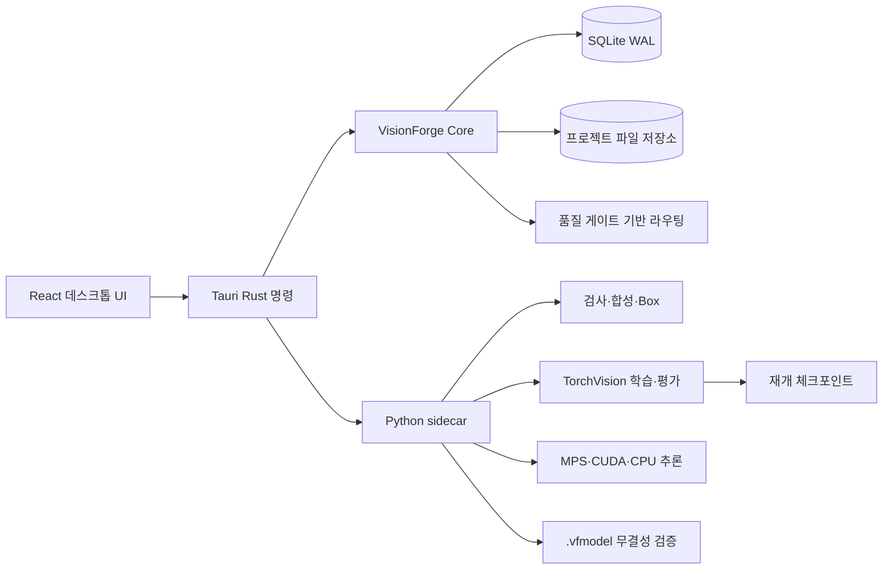

# VisionForge 구현 상태

> 기준일: 2026-07-13
> 앱 버전: 0.1.0
> 상태: `object_presence` 기능형 MVP + PyTorch 고성능 탐지 백엔드 후보 + macOS arm64 기능 검증

## 1. 현재 구조

Rust 코어가 프로젝트 경계, TaskSpec, 데이터셋 계보, 모델 상태와 결과 라우팅을 관리한다. Python 엔진은 이미지 처리와 모델 실행만 담당한다. 개발 모드는 프로젝트 가상환경을 사용하고, 배포 앱은 PyInstaller `onedir` 런타임을 Tauri 리소스로 포함한다.

## 2. 기능 상태

| 영역 | 상태 | 현재 구현 |
|---|---|---|
| 프로젝트·복원 | 구현 | SQLite WAL, 스키마 마이그레이션, 중단 작업 보존 |
| 동적 TaskSpec | v1 구현 | 상황 설명, 생성 정책, 결과 폴더, 이중 임계값, 리비전 |
| 이미지 등록·검사 | 구현 | 복사, SHA-256, 중복·손상·블러·밝기 경고 |
| 상황 기반 합성 | v1 구현 | 크기·회전·밝기·대비·블러·노이즈·가림, 시드·레시피 |
| Box·검토 | 부분 구현 | 가시 마스크 Box, 승인·제외, 좌표 수정 API |
| 데이터셋 | 구현 | 불변 manifest, 체크섬, 그룹 분할, TaskSpec 계보 |
| 고성능 학습 | 구현 | Faster R-CNN MobileNetV3 FPN 전이학습, MPS·CUDA·CPU |
| 장시간 학습 | 구현 | 30분 또는 epoch 체크포인트, 동일 작업 재개, 조기 종료 |
| 고해상도 추론 | 구현 | 전체 축소본 + 순차 타일, NMS, 항목별 오류 격리 |
| 품질 게이트 | 안전 기본값 구현 | 새 모델은 `candidate`, 실제 평가 전 자동 폴더 라우팅 차단 |
| 모델 공유 | 구현 | 가중치·TaskSpec·지표·라이선스·SHA-256 포함 `.vfmodel` |
| 교차 플랫폼 빌드 | 구성 구현 | 공용 Node 빌드 스크립트, Windows NSIS, macOS app·dmg 설정 |
| 실제 M1 검증 | 부분 완료 | M1 Pro 32GB에서 MPS·arm64 app·dmg 검증 완료, 16GB·장시간·배포 서명 시험 필요 |

## 3. 모델 백엔드

기본 `auto` 학습 백엔드는 `visionforge-torchvision-fasterrcnn-mobilenet-v3-v1`이다. 기존 NumPy/Pillow 선형 특징 탐지기는 테스트와 비교용으로만 명시적으로 선택할 수 있다.

- 사전학습 Faster R-CNN MobileNetV3-Large FPN 체크포인트를 로컬 리소스에서 SHA-256 검증 후 로드한다.
- COCO 다중 클래스 예측기를 배경·사용자 대상의 2개 클래스로 축소하고 일반 객체 특징을 초기값으로 사용한다.
- M1 Pro 16GB 프로필은 batch 1, gradient accumulation 8, DataLoader worker 0을 기본값으로 사용한다.
- CUDA만 자동 혼합 정밀도를 사용하며 MPS는 안정성 우선으로 FP32를 사용한다.
- 평가 데이터의 Precision·Recall·F1·IoU를 계산하고 목표 Precision을 우선하는 보수적 임계값을 선택한다.
- 모델 가중치와 메타데이터 체크섬이 다르면 추론을 거부한다.

## 4. 저장과 메모리

등록 원본, 사용자가 검토할 합성 이미지, 승인 상태, 불변 데이터셋, 모델과 결과는 프로젝트에 저장한다. 학습 시 추가 텐서 변형은 메모리에서만 만들고 별도 변형 이미지 파일로 누적하지 않는다. 데이터셋 로더는 한 장 또는 작은 배치만 디코딩한다.

`model.pt`는 현재 아키텍처에서 약 76MB다. 번들 사전학습 체크포인트는 77,844,807 bytes다. Windows PyPI CPU 런타임의 검증 빌드는 617,477,192 bytes였다. M1 arm64 빌드는 sidecar 약 537MB, `.app` 약 815MB, 압축 DMG 약 272MB로 측정됐다.

## 5. 오분류 방지

학습 완료는 자동 배포 완료를 뜻하지 않는다. 독립 검증 분할이 있으면 모델은 `candidate`, 없으면 `experimental`로 기록한다. `qualified`가 아닌 모델의 성공한 추론 결과는 신뢰도와 무관하게 검토 폴더로 강제된다. 처리 실패는 실패 상태를 유지한다.

이 정책은 실제 사진 평가 세트가 없는 현재 단계에서 잘못된 자동 전달을 막는다. 실제 평가 세트 등록, 점수 보정, 모델 비교와 `qualified` 승격 UI는 아직 구현되지 않았다.

## 6. 패키징

대용량 Torch 런타임을 단일 실행 파일로 압축하면 Windows CUDA 환경에서 PyInstaller 임시 archive가 약 2.33GB에 도달하며 Python 프로세스가 충돌했다. 학습이나 데이터 오류가 아니라 배포 압축 문제였다. 현재는 실행 파일과 라이브러리를 분리한 `onedir`를 앱 리소스로 포함하므로 해당 단일 파일 병목을 제거했다.

`uv.lock`은 Python 3.12용 PyTorch 2.11.0과 TorchVision 0.26.0을 고정한다. macOS arm64 MPS 휠과 Windows CPU 휠을 동일 잠금 파일에서 선택한다. 별도 CUDA 개발 환경은 선택 사항이며 최소 사양 기준이 아니다.

## 7. 검증 결과

| 검증 | 결과 |
|---|---|
| Python 단위 테스트 | 14 passed, 1 opt-in skipped |
| Torch 사전학습 통합 테스트 | MPS 1 passed, CPU 1 passed, 이전 CUDA 1 passed |
| Python Ruff | 통과, cache 비활성화 |
| Rust core 테스트 | 11 passed |
| Rust desktop 테스트 | 3 passed, 전체 로컬 파이프라인 포함 |
| React TypeScript | 통과 |
| Vitest | 4 passed |
| Vite production build | 통과 |
| CUDA `onedir` sidecar | system-profile, 실제 모델 추론, 1 epoch 학습 통과 |
| 잠금 기반 CPU `onedir` sidecar | 617MB 빌드 성공, 새 unsigned 실행 파일은 현재 Windows 앱 제어 정책에 차단 |
| Rust desktop 테스트 실행 | 바이너리 생성 성공, 현재 Windows 앱 제어 정책이 실행 전 차단 |
| M1 Pro 32GB MPS | fallback 비활성 상태의 학습·평가·추론, 기본 640–960 정책, 2000px 타일 추론 통과 |
| macOS arm64 sidecar | MPS·CPU provider와 PyTorch 2.11.0/TorchVision 0.26.0 실행 확인 |
| macOS arm64 번들 | ad-hoc hardened-runtime app 서명 검증, DMG checksum·마운트·내부 앱 검증 통과 |

통합 테스트의 작은 도형 데이터는 엔진 동작만 검증하며 상용 정확도 근거가 아니다. 1 epoch 결과의 F1이 낮아도 정상적인 기계적 통합 시험이다.

## 8. 미완료 조건

- M1 Pro 16GB 기준 장비에서 메모리 한계와 처리량 재검증
- 24시간 이상 메모리·발열·절전·체크포인트 재개 시험
- 실제 촬영 고정 평가 세트와 상용 품질 기준
- 모델 `qualified` 승격과 이전 모델 비교 UI
- Core ML·ONNX 변환 및 실행 경로
- OCR, 배번호 식별, 세밀 분류, 이상 탐지용 추가 백엔드
- 생성 캐시 용량 상한과 시작 전 전체 저장량 예측 UI
- Developer ID 코드 서명, notarization, Gatekeeper 최초 실행 시험
- macOS 14 빌드 호스트 또는 실제 Sonoma 장비의 하위 호환성 시험
- 사전학습 체크포인트와 COCO 관련 상용 배포 법률 검토

## 9. 다음 실행 순서

1. M1 Pro 16GB에서 동일 arm64 빌드와 기준 데이터 벤치마크를 반복한다.
2. 실제 촬영 사진으로 고정 평가 세트를 만들고 MPS·CPU 결과를 비교한다.
3. 24시간 이상 중단·재개 시험과 72시간 기준 작업 벤치마크를 수행한다.
4. MPS OOM 이후 항목 격리·복구 동작을 자동화해 검증한다.
5. macOS 14 실기 호환성과 Developer ID 서명·notarization을 완료한다.
6. 품질 승격 기능까지 완료한 뒤 상용 배포를 판정한다.

상세 구현은 [HIGH_PERFORMANCE_BACKEND_IMPLEMENTATION.md](HIGH_PERFORMANCE_BACKEND_IMPLEMENTATION.md), 요구사항은 [VISIONFORGE_REQUIREMENTS_SPEC.md](VISIONFORGE_REQUIREMENTS_SPEC.md)를 기준으로 한다.
