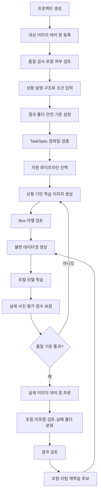

# VisionForge 통합 요구사항 정의서

> 문서 버전: 2.0  
> 작성일: 2026-07-12  
> 기준 자료: `VisionForge 통합 추가 확정 요구사항.pdf`, `VISIONFORGE_PRODUCT_PLAN.md`, 범용 동적 학습·분류 추가 요구사항  
> 우선순위: 본 문서가 기존 기획 및 구현 설명과 충돌할 경우 본 문서를 우선한다.

## 1. 문서 목적

이 문서는 VisionForge가 구현해야 하는 제품 기능, 데이터 구조, 안전 기준, 오프라인 실행 조건과 수용 기준을 정의한다. 기존 PDF의 확정 요구사항에 다음 범용 동적 요구사항을 추가한다.

> 사용자가 학습 대상 이미지 목록, 실제 입력 이미지가 촬영될 상황, 원하는 결과 분류 방법을 설명하면 VisionForge가 이를 검증 가능한 작업 명세로 변환하고, 상황에 맞는 학습 데이터를 준비하여 적합한 비전 모델을 학습한 뒤, 입력 이미지를 지정한 결과 폴더로 보수적으로 분류해야 한다.

## 2. 제품 정의

VisionForge는 이미지 기반 작업을 사용자가 직접 정의하고 로컬에서 학습·검증·실행하는 Windows 및 macOS 데스크톱 프로그램이다.

사용자는 다음 세 가지를 중심으로 작업을 정의한다.

1. 무엇을 찾거나 구분할 것인지 나타내는 대상 이미지 목록
2. 실제 사진의 장소, 거리, 각도, 조명, 가림, 대상 개수 등 상황 설명
3. 포함·미포함·대상별·불확실·실패 등 결과 분류 방법과 폴더 규칙

VisionForge는 작업 정의를 구조화하고, 지원하는 비전 파이프라인을 선택하며, 필요한 학습 데이터를 준비하고, 모델을 학습·평가한 뒤, 여러 입력 이미지를 일괄 처리한다.

## 3. 핵심 원칙

| ID | 원칙 | 요구사항 |
|---|---|---|
| PR-001 | 이미지 전용 AI | 학습·추론·탐지·분류의 AI 입력은 정지 이미지로 제한한다. 관리용 텍스트는 허용한다. |
| PR-002 | 다중 이미지 우선 | 단일 이미지도 이미지 1개인 목록으로 처리하며 모든 단계는 다중 이미지 API를 사용한다. |
| PR-003 | 완전 오프라인 | 설치 후 핵심 기능은 인터넷과 외부 서버 없이 실행되어야 한다. |
| PR-004 | 로컬 데이터 소유 | 사용자 이미지·모델·로그를 동의 없이 외부로 전송하지 않는다. |
| PR-005 | 원본 보존 | 자동 검사·분류·실패 때문에 사용자 원본을 삭제하거나 이동하지 않는다. |
| PR-006 | 항목별 격리 | 한 이미지의 실패가 전체 일괄 작업을 실패시키지 않는다. |
| PR-007 | 보수적 자동화 | 확실하지 않은 결과를 임의 확정하지 않고 별도 검토 상태로 격리한다. |
| PR-008 | 재현성과 계보 | 원본, 생성 레시피, 라벨, 데이터셋, 모델, 추론 결과의 관계를 추적한다. |
| PR-009 | 동적 작업 명세 | 사용자 설명은 검증된 구조화 작업 명세로 변환한 뒤 실행한다. |
| PR-010 | 파이프라인 기반 범용성 | 하나의 모델로 모든 작업을 처리하지 않고 작업 유형에 맞는 검증된 파이프라인을 선택한다. |

## 4. 지원 범위

### 4.1 필수 플랫폼

- Windows x64
- macOS Apple Silicon
- CPU 추론 필수
- NVIDIA GPU와 Apple Silicon 가속은 장치별 확장 경로 제공
- 사용자의 Python, 패키지 관리자, 가상환경 수동 설치 금지
- 오프라인 설치 파일 및 오프라인 업데이트 구조 제공

#### 4.1.1 하드웨어 실행 프로필

- 세부 기준은 `HARDWARE_REQUIREMENTS.md`를 따른다.
- 필수 기준 장비는 MacBook Pro 16-inch, M1 Pro, 통합 메모리 16GB다.
- 지원한다고 표시한 작업 유형은 기준 장비에서 학습·평가·추론·폴더 분류까지 완료되어야 한다.
- 기준 학습 작업은 batch 1~2와 gradient accumulation을 사용해 최대 72시간 안에 완료되어야 한다.
- 프로젝트와 결과 경로는 외장 Thunderbolt NVMe를 포함한 사용자 지정 볼륨을 지원해야 한다.
- NVIDIA CUDA 등 다른 장비는 최소 사양이 아니라 선택형 가속 프로필로만 취급한다.
- 하드웨어 등급은 모델 품질 기준 통과를 대신하지 않는다.

### 4.2 AI 입력 범위

지원:

- JPG, PNG, WEBP, BMP 등 검증된 정지 이미지
- 대상 원본 이미지
- 배경·부정 이미지
- 합성·증강 이미지
- 검증·테스트 이미지
- 추론·재학습 이미지

MVP 제외:

- 동영상
- 웹캠과 실시간 카메라
- 화면·스트림 캡처
- 음성, 센서 데이터
- 문서·PDF를 AI 학습 데이터로 직접 처리하는 기능

## 5. 사용자와 운영 모드

### 5.1 학습 및 관리 모드

- 프로젝트와 작업 명세 생성
- 대상·배경·실제 이미지 등록
- 상황과 결과 규칙 설정
- 데이터 생성·검토
- 학습·평가·비교
- 모델과 프로젝트 내보내기
- 오탐·미탐 반영 및 재학습

### 5.2 추론 모드

- `.vfmodel` 가져오기
- 여러 이미지 또는 폴더 입력
- 보수적 일괄 판정
- 사용자 정의 폴더 분류
- 결과 검토·수정·내보내기

## 6. 기능 요구사항

### 6.1 프로젝트 관리

| ID | 요구사항 | 수용 기준 |
|---|---|---|
| FR-PRJ-001 | 프로젝트 생성·열기·자동 저장 | 사용자 지정 위치에서 생성하고 재실행 후 복원된다. |
| FR-PRJ-002 | 프로젝트 스키마 버전 관리 | 구버전 프로젝트를 순차 마이그레이션하고 지원 불가 버전을 명시한다. |
| FR-PRJ-003 | 프로젝트 백업·복원 | 원본, 명세, 데이터셋, 모델, 결과, 이력을 함께 보존한다. |
| FR-PRJ-004 | 작업 상태 복구 | 중단된 작업은 상태와 완료 항목을 보존한다. |
| FR-PRJ-005 | 모델 공유와 프로젝트 공유 분리 | 추론 모델 패키지는 원본 학습 이미지를 기본 포함하지 않는다. |

### 6.2 범용 동적 작업 정의

| ID | 요구사항 | 수용 기준 |
|---|---|---|
| FR-TASK-001 | 대상 이미지 목록 | 한 대상에 여러 기준 이미지를 등록할 수 있다. |
| FR-TASK-002 | 상황 자연어 입력 | 최대 길이와 지원 언어를 검증하고 원문을 보존한다. |
| FR-TASK-003 | 구조화 상황 설정 | 거리, 크기, 위치, 회전, 가림, 조명, 블러, 노이즈, 배경, 대상 개수와 분포를 설정할 수 있다. |
| FR-TASK-004 | 결과 규칙 설정 | 포함·미포함·검토 필요·처리 실패 및 작업별 결과 폴더명을 설정할 수 있다. |
| FR-TASK-005 | 안전 정책 설정 | 확정 양성·확정 음성의 기준과 불확실 구간을 별도로 설정한다. |
| FR-TASK-006 | 작업 명세 컴파일 | 자연어와 구조화 옵션을 `TaskSpec`으로 변환한다. |
| FR-TASK-007 | 명세 검증 | 지원하지 않는 조건을 임의 실행하지 않고 경고 또는 차단한다. |
| FR-TASK-008 | 명세 버전 | 수정할 때마다 새 리비전을 저장하고 사용한 리비전을 작업에 기록한다. |
| FR-TASK-009 | 파이프라인 선택 | 작업 유형에 맞는 등록된 비전 백엔드를 선택한다. |
| FR-TASK-010 | 설명 가능성 | 선택된 파이프라인, 생성 조건, 분류 규칙을 실행 전에 표시한다. |

### 6.3 작업 유형과 파이프라인

| 작업 유형 | 입력 예시 | 필수 출력 | 파이프라인 요구 |
|---|---|---|---|
| 사물 존재 여부 | 특정 제품·도구 이미지 | 포함·미포함·검토 | 객체 탐지 또는 이미지 분류 |
| 사물 위치·개수 | 여러 대상이 있는 장면 | Box·개수·상태 | 객체 탐지 |
| 정확한 문자열 식별 | 배번호·제품 코드 | 문자열별 폴더·검토 | 영역 탐지 + OCR + 허용 목록 대조 |
| 세밀 개체 구분 | 유사 제품·모델 | 대상별 폴더·검토 | 세밀 분류 또는 유사도 학습 |
| 결함·이상 구분 | 정상·불량 부품 | 정상·불량·검토 | 이상 탐지 또는 결함 분류 |

초기 구현은 `사물 존재 여부`를 지원한다. 다른 유형은 동일한 `TaskSpec`과 결과 라우터를 사용하되 백엔드 준비 전에는 지원된 것처럼 실행하지 않는다.

### 6.4 이미지 등록과 검사

| ID | 요구사항 |
|---|---|
| FR-IMG-001 | 여러 파일, 폴더, 드래그 앤 드롭, 기존 이미지 세트 입력을 지원한다. |
| FR-IMG-002 | 손상, 형식, 크기, 해상도, 중복, 유사 이미지, 흐림, 밝기, 대비를 검사한다. |
| FR-IMG-003 | 품질 검사는 경고와 우선순위이며 자동 영구 삭제의 근거로 사용하지 않는다. |
| FR-IMG-004 | 원본 파일 경로, 내부 경로, 체크섬, 크기, 형식, 역할과 검토 상태를 저장한다. |
| FR-IMG-005 | 대상이 작거나 불명확한 이미지는 사용자가 포함·제외할 수 있다. |

### 6.5 상황 기반 학습 이미지 생성

| ID | 요구사항 | 수용 기준 |
|---|---|---|
| FR-GEN-001 | 대상 형태 보존 합성 | 원본 전경을 보존하고 최종 가시 마스크로 Box를 계산한다. |
| FR-GEN-002 | 상황 조건 반영 | TaskSpec의 크기·회전·밝기·블러·노이즈·가림 분포가 생성 레시피에 반영된다. |
| FR-GEN-003 | 실제 배경 사용 | 실제 촬영 환경과 가까운 배경 및 강한 부정 이미지를 지원한다. |
| FR-GEN-004 | 다중 생성 | 생성 수, 상황별 수, 원본별 비율과 랜덤 시드를 지원한다. |
| FR-GEN-005 | 부정 데이터 | 대상이 없는 이미지와 유사하지만 다른 대상을 별도로 포함한다. |
| FR-GEN-006 | 자동 라벨 | 객체별 클래스, Box, 가림, 생성 레시피, 원본과 수정 이력을 기록한다. |
| FR-GEN-007 | 사용자 검토 | 다중 승인·제외, 확대, 원본 비교, Box 수정, 재생성을 제공한다. |
| FR-GEN-008 | 저장량 제어 | 미리보기 영구 저장과 학습 시점 일시 변형을 분리하고 캐시 한도를 적용한다. |
| FR-GEN-009 | 선택형 배경 생성 | 필요한 경우 오프라인 확장 패키지로 배경만 생성하며 대상 정체성을 변경하지 않는다. |

### 6.6 데이터셋

| ID | 요구사항 |
|---|---|
| FR-DATA-001 | 학습·검증·테스트 분할을 제공한다. |
| FR-DATA-002 | 같은 원본·촬영 그룹·합성 계보는 여러 분할에 퍼지지 않는다. |
| FR-DATA-003 | 양성, 음성, 합성, 실제, 수정 이미지의 출처 비율을 기록한다. |
| FR-DATA-004 | 생성된 데이터셋 버전은 불변이며 수정 시 새 버전을 만든다. |
| FR-DATA-005 | 파일 체크섬, 라벨 범위, 클래스, 그룹 누수를 생성 게이트에서 검사한다. |
| FR-DATA-006 | 추론 오탐·미탐·저신뢰 이미지를 새 버전에 포함할 수 있다. |

### 6.7 모델 학습과 평가

| ID | 요구사항 |
|---|---|
| FR-TRAIN-001 | 모든 학습은 로컬에서 실행한다. |
| FR-TRAIN-002 | 기본 설정과 고급 설정, 장치 자동 감지, CPU 경로를 제공한다. |
| FR-TRAIN-003 | 단계, 처리량, Epoch, 로그, 메모리, 중단, 체크포인트와 실패 정보를 제공한다. |
| FR-TRAIN-004 | 사전 학습 기반 비전 모델을 우선 검토하고 소량 사용자 데이터의 일반화를 개선한다. |
| FR-TRAIN-005 | 모델은 정확히 하나의 데이터셋과 TaskSpec 리비전을 참조한다. |
| FR-TRAIN-006 | 실제 사진 고정 평가 세트에서 정밀도·재현율·F1·IoU와 작업별 오류 비용을 평가한다. |
| FR-TRAIN-007 | 점수를 확률처럼 표시하려면 실제 검증 세트로 보정한다. |
| FR-TRAIN-008 | 품질 기준을 통과하지 못한 모델은 자동 분류용 배포를 차단한다. |
| FR-TRAIN-009 | 동일 평가 세트에서 이전 모델과 새 모델을 비교한다. |

### 6.8 다중 이미지 추론

| ID | 요구사항 |
|---|---|
| FR-INF-001 | 여러 파일과 폴더를 일괄 입력한다. |
| FR-INF-002 | 각 이미지의 성공·실패·시간·모델·TaskSpec을 독립 기록한다. |
| FR-INF-003 | 대상 존재, 개수, 위치, Box, 클래스와 점수를 저장한다. |
| FR-INF-004 | 일부 이미지 실패 후 나머지 이미지를 계속 처리한다. |
| FR-INF-005 | 원본과 Box 표시 결과 이미지의 연결 관계를 유지한다. |
| FR-INF-006 | 분포 밖 입력, 상충 결과, 낮은 품질을 검토 필요로 격리한다. |

### 6.9 보수적 결과 판정과 폴더 분류

| ID | 요구사항 | 기본 동작 |
|---|---|---|
| FR-ROUTE-001 | 확정 포함 | 보정 점수가 양성 기준 이상일 때만 포함 폴더로 복사한다. |
| FR-ROUTE-002 | 확정 미포함 | 최고 후보 점수가 음성 기준 이하일 때만 미포함 폴더로 복사한다. |
| FR-ROUTE-003 | 검토 필요 | 두 기준 사이, 상충 결과, 분포 밖 입력은 검토 폴더로 복사한다. |
| FR-ROUTE-004 | 처리 실패 | 손상·디코딩·엔진·저장 실패는 실패 폴더 또는 manifest에 기록한다. |
| FR-ROUTE-005 | 사용자 정의 폴더명 | 경로 탈출과 운영체제 예약명을 차단한다. |
| FR-ROUTE-006 | 원본 보존 복사 | 기본은 내부 보존본을 결과 폴더로 복사하며 원본을 이동하지 않는다. |
| FR-ROUTE-007 | 파일명 충돌 | 같은 파일명은 결정적으로 변경하여 덮어쓰지 않는다. |
| FR-ROUTE-008 | 결과 manifest | 원본명, 결정, 점수, 탐지 수, 모델, 출력 경로, 오류를 JSON과 CSV 후보 형식으로 기록한다. |
| FR-ROUTE-009 | 재실행 격리 | 각 실행은 고유 폴더를 사용한다. |

### 6.10 결과 검토와 반복 학습

| ID | 요구사항 |
|---|---|
| FR-FB-001 | 목록·테이블·갤러리 보기와 다중 선택을 제공한다. |
| FR-FB-002 | 승인, 제외, 오탐, 미탐, 검토 필요, 재학습 후보 상태를 제공한다. |
| FR-FB-003 | 사용자 수정 결과는 원본 추론 결과와 분리해 보존한다. |
| FR-FB-004 | 선택한 실제 이미지를 새 데이터셋 버전에 추가한다. |
| FR-FB-005 | 재학습 전후 모델을 동일 실제 평가 세트에서 비교한다. |

### 6.11 모델 공유

| ID | 요구사항 |
|---|---|
| FR-MODEL-001 | 학습 모델을 하나의 `.vfmodel` 파일로 내보낸다. |
| FR-MODEL-002 | 클래스, TaskSpec, 전처리, 후처리, 결정 기준, 지표, 호환성, 라이선스와 체크섬을 포함한다. |
| FR-MODEL-003 | 가져오기 시 경로 탈출, 압축 폭탄, 변조, 스키마와 런타임 호환성을 검사한다. |
| FR-MODEL-004 | 다른 컴퓨터에서 재학습 없이 즉시 추론한다. |
| FR-MODEL-005 | Windows와 macOS 사이의 기능적 동일성을 검증한다. |
| FR-MODEL-006 | OS·사용자 경로·특정 GPU에 종속된 정보를 모델 진실의 원천으로 저장하지 않는다. |

### 6.12 작업 관리

| ID | 요구사항 |
|---|---|
| FR-JOB-001 | 등록, 생성, 데이터셋, 학습, 평가, 추론, 라우팅, 내보내기를 작업으로 관리한다. |
| FR-JOB-002 | 전체·대기·실행·완료·실패 수와 최근 체크포인트를 저장한다. |
| FR-JOB-003 | 중단·취소·재개와 프로그램 재시작 후 복구를 지원한다. |
| FR-JOB-004 | 디스크 부족과 프로세스 충돌 시 원본과 완료 산출물을 보존한다. |

## 7. TaskSpec 데이터 계약

```json
{
  "schemaVersion": 1,
  "id": "uuid",
  "revision": 1,
  "taskType": "object_presence",
  "targetClass": {
    "id": "uuid",
    "name": "특정 사물"
  },
  "scenario": {
    "description": "실내외 사진이며 대상이 작거나 일부 가려질 수 있음",
    "compiledTags": ["small_target", "occlusion", "mixed_lighting"]
  },
  "generationPolicy": {
    "scaleMin": 0.2,
    "scaleMax": 1.1,
    "rotationMin": -25,
    "rotationMax": 25,
    "brightnessMin": 0.55,
    "brightnessMax": 1.35,
    "blurRadiusMax": 1.6,
    "noiseStddevMax": 0.04,
    "occlusionMax": 0.35
  },
  "outputPolicy": {
    "presentFolder": "사물_포함",
    "absentFolder": "사물_미포함",
    "reviewFolder": "검토_필요",
    "failedFolder": "처리_실패",
    "positiveThreshold": 0.85,
    "negativeThreshold": 0.35,
    "copyMode": "copy_original"
  }
}
```

TaskSpec은 JSON 스키마 검증 후에만 저장·실행한다. 자연어 해석기는 이 계약 외의 임의 코드나 파일 경로를 생성할 수 없다.

## 8. 로컬 LLM과 이미지 생성 모델 원칙

### 8.1 로컬 LLM

- 객체 탐지 모델 학습에 LLM을 사용하지 않는다.
- 자유로운 자연어가 필요한 경우 LLM은 문장을 TaskSpec으로 변환하는 보조 역할만 한다.
- 구조화 옵션과 규칙·키워드 파서로 충분하면 기본 설치에는 LLM을 포함하지 않는다.
- 선택형 LLM은 오프라인 패키지, 재배포 가능한 라이선스, CPU 경로와 JSON 강제 출력을 가져야 한다.

### 8.2 로컬 이미지 생성 모델

- 기본값은 대상 보존 2D 합성이다.
- 생성형 모델이 대상 자체를 다시 그리게 하지 않는다.
- 선택형 생성 모델은 배경 또는 주변 장면 생성에 우선 사용한다.
- 대상 형태·문자·로고 훼손, 자동 Box 오류, 설치 용량, 메모리와 라이선스를 별도 검증한다.

## 9. 비기능 요구사항

| ID | 요구사항 |
|---|---|
| NFR-001 | 네트워크 차단 상태에서 전체 기본 흐름이 완료되어야 한다. |
| NFR-002 | 이미지는 한 장 또는 제한된 배치만 디코딩해 메모리를 제한한다. |
| NFR-003 | 임시 파일은 원자적 쓰기와 재시작 정리를 사용한다. |
| NFR-004 | 생성 캐시와 프로젝트 저장량에 사용자 설정 한도를 둔다. |
| NFR-005 | 입력 경로·폴더명·압축 파일의 경로 탈출을 차단한다. |
| NFR-006 | 모델·데이터셋·결과 파일은 SHA-256 무결성 정보를 가진다. |
| NFR-007 | 로그에는 오류 코드, 단계, 이미지 ID를 기록하며 민감한 외부 경로 노출을 제한한다. |
| NFR-008 | 대량 목록 UI는 가상 스크롤 또는 페이지 처리를 사용한다. |
| NFR-009 | 작업 결과는 결정적 시드와 버전으로 재현 가능해야 한다. |
| NFR-010 | 접근성, 키보드 조작, 축소 화면과 고해상도 화면을 지원한다. |
| NFR-011 | 프로그램은 OS·아키텍처·CPU·RAM·가속 공급자·가속기 메모리·디스크 여유 공간을 자동 검사한다. |
| NFR-012 | 고정 샘플 벤치마크로 준비·학습·추론 처리량과 최대 메모리를 측정해 실행 등급을 확정한다. |
| NFR-013 | 실행 등급에 따라 모델 크기·해상도·batch·gradient accumulation·worker·정밀도를 안전하게 자동 설정한다. |
| NFR-014 | 예상 학습 시간과 저장량을 시작 전에 표시하고 M1 Pro 16GB 기준에 맞는 모델·batch·cache 설정을 선택한다. |
| NFR-015 | 모델에 학습 장비, 실행 공급자, 라이브러리 버전과 벤치마크 결과를 계보 정보로 기록한다. |
| NFR-016 | 24시간을 넘는 학습은 주기적 체크포인트, 프로세스 재시작 후 재개와 메모리 누수 시험을 통과해야 한다. |
| NFR-017 | MPS·Core ML 미지원 연산의 CPU fallback을 기록하고 결과 일치와 예상 시간 기준을 검증한다. |

## 10. 안전 요구사항

1. 낮은 신뢰도 결과를 확정 폴더로 보내지 않는다.
2. 문자·신원 식별 작업은 일반 사물 탐지기로 대신하지 않는다.
3. 사용 가능한 대상 목록과 상충하는 결과는 검토 필요로 보낸다.
4. 실제 검증 데이터가 없거나 품질 기준을 통과하지 못한 모델에는 실험용 경고를 표시한다.
5. 결과 폴더 작업은 복사 방식이 기본이며 원본 이동·삭제를 금지한다.
6. 동일 파일명과 재실행으로 기존 결과를 덮어쓰지 않는다.
7. 지원하지 않는 작업 유형은 명확히 차단하고 그럴듯한 결과를 만들지 않는다.

## 11. 사용자 흐름



## 12. MVP와 단계별 범위

### 12.1 범용 동적 v1 필수

- 사물 존재 여부 작업 유형
- 대상 이미지 여러 장
- 상황 설명 저장 및 규칙 기반 TaskSpec 컴파일
- 크기·회전·밝기·블러·노이즈·가림 기반 동적 합성 정책
- 사용자 정의 포함·미포함·검토·실패 폴더
- 양성·음성 이중 임계값과 불확실 구간
- 원본 보존 복사와 JSON 결과 manifest
- 오프라인 학습·추론·모델 패키지

### 12.2 후속 필수 확장

- 사전 학습 기반 범용 탐지 모델과 실제 검증 보정
- OCR·문자 식별 파이프라인
- 세밀 분류·유사도 파이프라인
- 이상 탐지 파이프라인
- 오탐·미탐 재학습 UI
- CSV·JSON·ZIP 일괄 내보내기
- macOS 설치·서명·교차 플랫폼 검증

### 12.3 선택 확장

- 선택형 로컬 LLM
- 선택형 로컬 배경 생성 모델
- GPU별 가속 패키지
- 추론 전용 경량 앱

## 13. 범용 동적 v1 수용 기준

| ID | 시나리오 | 합격 조건 |
|---|---|---|
| AC-001 | 서로 다른 사물 프로젝트 | 동일 프로그램에서 각각 다른 TaskSpec과 모델을 만든다. |
| AC-002 | 상황 설명 | `작음`, `가림`, `어두움`, `흐림`, `노이즈`가 생성 정책과 레시피를 바꾼다. |
| AC-003 | 폴더 라우팅 | 포함·미포함·검토·실패 폴더와 manifest가 실행별로 생성된다. |
| AC-004 | 불확실 격리 | 두 임계값 사이 결과는 확정 폴더로 들어가지 않는다. |
| AC-005 | 원본 보존 | 입력 원본은 수정·이동·삭제되지 않는다. |
| AC-006 | 파일명 충돌 | 같은 이름의 여러 파일이 모두 보존된다. |
| AC-007 | 항목 실패 격리 | 손상 이미지가 있어도 나머지 결과가 생성된다. |
| AC-008 | 오프라인 | 네트워크 차단 상태에서 생성·학습·추론·라우팅이 완료된다. |
| AC-009 | 재현성 | 같은 TaskSpec·원본·시드는 같은 생성 레시피와 라벨을 만든다. |
| AC-010 | 지원 범위 차단 | OCR 등 미구현 파이프라인을 일반 탐지로 위장하지 않는다. |
| AC-011 | 하드웨어 판정 | 같은 장비와 소프트웨어 버전에서 고정 벤치마크가 동일 실행 등급을 반환한다. |
| AC-012 | M1 기준 장비 | M1 Pro 16GB에서 지원 작업의 학습·평가·추론·라우팅이 메모리 부족 없이 완료된다. |
| AC-013 | 장시간 학습 | 24시간 이상 학습을 중단·재시작해 마지막 정상 체크포인트부터 재개한다. |

## 14. 구현 완료 정의

기능은 다음 조건을 모두 만족할 때 완료로 본다.

- 요구사항 ID에 대응하는 코드와 테스트가 있다.
- 정상·경계·실패·복구 시나리오가 자동 테스트된다.
- 실제 촬영 고정 평가 세트에서 정의된 품질 기준을 통과한다.
- 생성물과 모델의 계보·체크섬·TaskSpec 리비전이 추적된다.
- Windows 설치 앱에서 터미널 없이 실행된다.
- macOS 필수 범위는 macOS 장비에서 별도 검증된다.
- 알려진 한계와 실험용 모델 경고가 사용자에게 표시된다.
